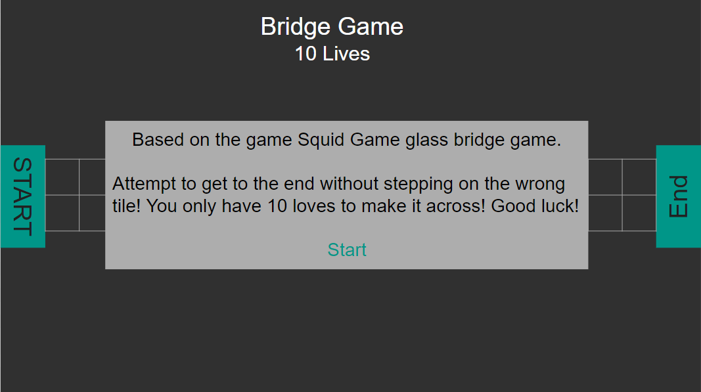

# Bridge Game

## Description 

A browser-based version of the popular show Squid Game glass bridge game coded in JavaScript, HTML, and CSS. Objective of the game is to get to the end without losing all your lives and falling to your death....I mean pillows.

## Planning Process

### User Stories

#### MVP

- As a user, I want a browser-based interface so that I can play the game.
- As a user, I want there to be an algorithm to randomize the path on the bridge for every game.
- As a user, I want to be able to see where I place my token so that I can interact with the game.
- As a user, I want the game to reset so that it gives the option to continue with the next life.
- As a user, I want a life count to let me know how many turns I have left.

#### Bronze

- As a user, I want there to be a time-limit to finish the game so that it makes it more intense.
- As a user, I want an alert to pop up modal when I win or lose.

#### Silver

- As a user, I want the option to select my own token when playing.
- As a user, I want options for different levels of difficulty.

#### Gold

- As a user, I want to upload an image as my token.

### Wireframes
